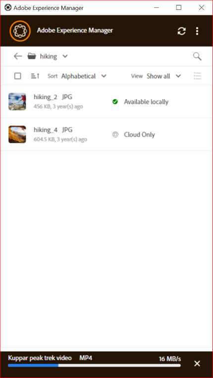

# アセットのアップロード {#upload-assets}

アセットを追加する権限を持つAEM デスクトップアプリユーザーは、アセット（画像、ドキュメント、ビデオ、その他のメディアなど）を追加できます。

## アセットの編集と [!DNL Experience Manager] への更新済みアセットのアップロード {#edit-assets-upload-updated-assets}

アセットに変更を加え、更新したアセットを [!DNL Experience Manager] サーバーにアップロードする際は、アセットを編集用に開きます。他のユーザーの編集内容と競合しないように、デスクトップアプリケーションを使用して編集セッションを開始します。編集を開始する前に、別のユーザーがアセットを編集していることを示すロックアイコンがアセットに付いていないことを確認します。

アセットを編集するには、該当するアセットを検索するか、アセットの場所を参照します。 アイコンをクリックし、「**[!UICONTROL Edit]**」をクリックします。

次のどちらの状況でも、他のユーザーの編集と競合しないように、「**[!UICONTROL Toggle Check-out]**」を使用してアセットをロックします。

* 先にアセットをチェックアウトせずに（例えば単に開いて）アセットの編集を開始した。
* アセットの編集をすぐに開始するつもりであり、他のユーザーには編集されないようにしたい。

編集が完了すると、変更したアセットのステータスが「**[!UICONTROL Edited Locally]**」としてデスクトップアプリケーションに表示されます。アセットに保存した変更は、[!DNL Experience Manager] にアップロードするまでは、すべてローカルのみの変更になります。個々のアセットまたは複数のアセットを 1 つずつアップロードするには、アセットのオプションから「**[!UICONTROL Upload Changes]**」をクリックします。そのアセットの 1 つのバージョンが [!DNL Experience Manager] に作成されます。[!DNL Assets] の web インターフェイスを使用して、[タイムラインビュー](https://experienceleague.adobe.com/ja/docs/experience-manager-65/content/assets/using/activity-stream)でアセット履歴を参照できます。

共同編集に関するベストプラクティスについては、[高度なワークフロー：同じファイルに対する共同作業と編集上の競合の回避](#adv-workflow-collaborate-avoid-conflicts)を参照してください。

次の場合は、ローカルアセットに対する変更や編集を破棄することができます。「**[!UICONTROL Discard Changes]**」をクリックします。

* 変更内容を [!DNL Experience Manager] にローカルに保存しない場合。
* 変更内容を保存した後、元のアセットに対する変更を開始した場合。
* 必要なくなったのでアセットの編集を停止した場合。

必要に応じて、チェックアウトを切り替えます。更新されたアセットがローカルキャッシュフォルダーから削除され、編集時または開く際に再度ダウンロードされます。

## [!DNL Experience Manager] への新しいアセットのアップロードと追加 {#upload-and-add-new-assets-to-aem}

ユーザーは、DAM リポジトリーに新しいアセットを追加できます。例えば、代理店のフォトグラファーや請負業者は、撮影した大量の写真を [!DNL Experience Manager] リポジトリーに追加したいと考えるかもしれません。新しいコンテンツを [!DNL Experience Manager] に追加するには、アプリの上部バーにある  をクリックします。ローカルファイルシステム内のアセットファイルを参照し、「**[!UICONTROL Select]**」をクリックします。または、アプリケーションインターフェイス上でファイルまたはフォルダーをドラッグしてアセットをアップロードします。Windows では、アプリ内のフォルダーにアセットをドラッグすると、そのアセットがフォルダーにアップロードされます。アップロードに時間がかかる場合、アプリには進行状況バーが表示されます。

<!-- 
-->

ローカルファイルシステムからフォルダーや個々のファイルをアップロードできます。フォルダーの階層はアップロード時に保持されます。アセットを一括でアップロードする場合は、まず[バルクアップロード](#bulk-upload-assets)を参照してください。

特定のセッションで転送されたアセットのリストを表示するには、**[!UICONTROL View]**／**[!UICONTROL Assets transfers]** を選択します。このリストを見れば、現在のセッションのファイル転送をざっと確認できます。

**[!UICONTROL Preferences]**／**[!UICONTROL Upload acceleration]** の設定で、アップロードの同時実行性（高速化）を制御できます。通常は、同時実行性が高いほど、アップロードが高速になりますが、その反面、リソースの消費が大きくなり、ローカルマシンで消費される処理能力が増える可能性があります。システムの処理速度が低下した場合は、同時実行性の設定値を低くして、アップロードを再度試みます。

>[!NOTE]
>
>転送リストは永続的なものではなく、デスクトップアプリケーションを終了して再度開いた場合は使用できません。

## アセットの一括アップロード {#bulk-upload-assets}

カメラマンやクリエイティブ制作代理店などのユーザーまたは組織は、撮影、レタッチ、大量の写真からの選択など、アクティビティ中に、多数のローカルアセットを作成できます。これらのタスクは多くの場合、[!DNL Experience Manager] の外部で行われます。これらの大きなローカルフォルダーを、デスクトップアプリケーションから直接 [!DNL Assets] にアップロードできます。フォルダー階層が保持され、ネストしたサブフォルダーとその中に含まれているアセットがすべてアップロードされます。アップロードしたアセットは、同じサーバーの他のユーザーからもすぐに利用できます。アセットはバックグラウンドでアップロードされるので、操作が web ブラウザーセッションに縛られることはありません。

![デスクトップから [!DNL Experience Manager]](assets/upload_local_folders_da2.png " への複数のローカルフォルダーのバルクアップロードデスクトップから Experience Manager への複数のローカルフォルダーのバルクアップロード")

アップロード後に、期待した変更がデスクトップアプリケーションに反映されない場合は、更新アイコン  をクリックします。

>[!NOTE]
>
>アップロード機能を使用して 2 つの [!DNL Experience Manager] デプロイメントをまたいでアセットを移行することは避けてください。その代わり、[移行ガイド](https://experienceleague.adobe.com/ja/docs/experience-manager-65/content/assets/administer/assets-migration-guide)を参照してください。

## 次の手順 {#next-steps}

* [ビデオを視聴して Adobe Experience Manager デスクトップアプリケーションの基本を学ぶ](https://experienceleague.adobe.com/ja/docs/experience-manager-learn/assets/creative-workflows/aem-desktop-app)

* 右側のサイドバーにある「[!UICONTROL Edit this page]」または「[!UICONTROL Log an issue]」を使用してドキュメントに関するフィードバックを提供する

* [カスタマーケア](https://experienceleague.adobe.com/ja?support-solution=General#support)に問い合わせる

>[!MORELIKETHIS]
>
>* [アセットのダウンロード](/help/using/download-assets.md)
>* [ユーザーインターフェイスについて](/help/using/user-interface.md)
>* [検索](/help/using/search.md)
