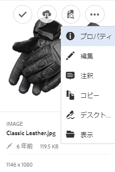

# [!DNL Experience Manager] デスクトップアプリケーション v1.10 の使用  {#use-aem-desktop-app-v1x}

デスクトップアプリケーションを使用すると、[!DNL Experience Manager] 内のアセットにローカルデスクトップから手軽にアクセスし、任意のデスクトップアプリケーションで利用できるようになります。アセットは Mac Finder や Windows エクスプローラーで容易に表示したり、デスクトップアプリケーションで開いたり、ローカルで変更したりできます。変更内容は [!DNL Experience Manager] に保存され、リポジトリー内に新しいバージョンが作成されます。

この統合により、Creative Cloudや他のアプリケーション全体でアセット管理とアクセスを一元化でき、ブランディングやその他の標準への準拠を確保できます。

を使用して行う主なタスク [!DNL Experience Manager] デスクトップアプリケーション v1 の主な内容：

1. [ [!DNL Experience Manager]  サーバーと接続する](#installandconnect)
1. [デスクトップアプリケーションで直接アセットを開く](#openondesktop)
1. [デスクトップアプリケーションからのアセットの編集とチェックアウト](#workonassets)
1. [アセットおよびフォルダーを一括アップロードする](#bulkupload)

様々な推奨事項や注意事項については、を参照してください [デスクトップアプリケーションを使用する場合のベストプラクティス](best-practices-for-v1.md). アプリの使用で問題が発生した場合は、その方法を参照してください [トラブルシューティング [!DNL Experience Manager] デスクトップアプリケーション](troubleshoot-app-v1.md).

>[!NOTE]
>
>デスクトップアプリケーションは [!DNL Experience Manager] 6.1 リリースで導入され、当初は [!DNL Experience Manager Assets Companion App] と呼ばれていました。

## クリエイティブワークフローでの [!DNL Experience Manager] デスクトップアプリケーションのタッチポイント {#aem-desktop-app-touch-points-in-the-creative-workflow}

[!DNL Experience Manager] デスクトップアプリケーションおよび [!DNL Assets] はクリエイティブワークフローで統合され、以下のタッチポイントが提供されます。

![[!DNL Experience Manager] デスクトップアプリケーションのタッチポイント（クリエイティブワークフロー）](assets/aem_desktopapp_workflow.png)

[!DNL Experience Manager] デスクトップアプリケーションのタッチポイント（クリエイティブワークフロー）

## デスクトップアプリケーションのインストールと AEM への接続 [!DNL Experience Manager] サーバー {#installandconnect}

クリエイティブアセットの作成または編集を開始するには、まず、リポジトリーのアセットをダウンロードおよびアップロードするためにデスクトップアプリケーションを [!DNL Assets] サーバーに接続します。以下の作業をおこないます。

1. [アプリをインストールします](#installapp)。
1. [環境設定](#inapppref)および接続の詳細を設定します。
1. [ [!DNL Experience Manager]  サーバーに接続](#connect)し、アセットリポジトリーをローカルドライブとしてマウントします。
1. [デスクトップアクションの有効化](#desktopactions) 日 [!DNL Experience Manager] サーバー。

この [!DNL Experience Manager] デスクトップアプリケーションは HTTPS 接続を使用してに接続します [!DNL Experience Manager] サーバー：アセットをロバストかつ安全に転送します。

>[!NOTE]
>
>インストールと設定の手順のすべてまたは一部については、のサポートが必要な場合があります。 [!DNL Experience Manager] 管理者またはシステム管理者。

### アプリケーションのインストール {#installapp}

Experience Managerデスクトップアプリケーションを使用する場合、アプリケーションがExperience Managerサーバーのバージョンをサポートしていることを確認します。 使用するオペレーティングシステム（Mac または Windows）に適したインストールファイル（バイナリ）をダウンロードして、アプリケーションをインストールします。

ネットワークおよびシステムの環境設定によっては、詳細な設定が必要になることがあります。詳しくは、[ [!DNL Experience Manager]  デスクトップアプリケーションのインストールと設定](install-configure-app-v1.md)を参照してください。

1. [[!DNL Experience Manager]  デスクトップアプリケーション v1.10 のダウンロードページ](/help/using/release-notes-of-v1.md)に移動し、オペレーティングシステムに適したバイナリをダウンロードします。
1. ダウンロードしたインストールファイルを実行し、画面上の指示に従ってアプリケーションをインストールします。

   >[!NOTE]
   >
   >インストールして一度にアクティブ化できる [!DNL Experience Manager] デスクトップアプリケーションのインスタンスは 1 つだけです。

### アプリケーション内のオプションと環境設定について {#inapppref}

アプリケーションでは、接続および切断の設定を [!DNL Experience Manager] サーバー、アップロードのステータスの表示、ローカルキャッシュの管理などを行います。 通常は、デフォルト設定で使用することができます。設定を調整して、アプリケーションをさらに活用できます。 との統合からさらに多くのメリットを得ることができます [!DNL Experience Manager] サーバー。 様々な設定を次に示します。

**Explore Assets**：[!DNL Assets] リポジトリーをマウントしたローカルドライブを開きます。つまり、ローカルマシンで利用できるようになったアセットを参照します。

**View Asset Status**：変更したアセットを [!DNL Assets] リポジトリーにアップロードしたり、新しいアセットを追加したりするときは、アセットがバックグラウンドでアップロードされます。バックグラウンドで処理されるので、サイズの大きいアセットでもアップロード完了まで待つ必要がなくなり、円滑な作業が可能になります。ユーザーは変更内容をローカルで保存するだけです。これらのアセットをアプリケーションからサーバーに送信するには、ある程度の時間がかかります（利用可能な帯域幅によります）。アップロードのステータスや、その他いくつかの基本情報を確認できます。

**オプション** デスクトップアプリトレイのオプションをクリックして、起動時にアプリケーションを起動するように設定し、に接続します。 [!DNL Experience Manager] 起動時にサーバーを起動し、のローカルドライブ文字を変更する [!DNL Assets] 取り付け後。

**Advanced／Manage Cache**：ローカルキャッシュに使用するディスク容量を管理できます。[!DNL Assets] サーバーのアーティファクトがローカルにキャッシュされ、スムーズに利用できるようになります。要件に応じてデフォルト設定を変更することができます。キャッシュをクリアして、すべてのアセットを取得し直すこともできます。キャッシュをクリアした場合でも、未保存の変更内容は維持されます。にチェックインされていないすべてのアセット [!DNL Experience Manager] サーバーは保持され、削除されません。

### [!DNL Experience Manager] サーバーへの接続  {#connect}

アプリは、Windows および Mac のプロキシ設定をサポートします。設定はアプリの起動時に読み込まれます。プロキシ設定を変更した場合は、変更を適用するためにアプリを再起動します。

>[!NOTE]
>
>プロキシ設定を変更した場合は、変更を適用するためにアプリを再起動します。それ以外の場合、アプリは設定済みのプロキシサーバーを引き続き使用します。

1. を起動する [!DNL Experience Manager] デスクトップアプリケーション。 アプリケーションに [!DNL Experience Manager] インスタンスをマッピングするには、[!DNL Experience Manager] サーバーを `https://[aem-server-url]:[port]` の形式で指定します。

   ![Mac での認証と [!DNL Experience Manager] サーバー URL の提供](assets/aem_desktop_app_server_url.png)

1. ログイン画面で、インスタンスのユーザー名とパスワードを指定します。別の [!DNL Experience Manager] インスタンスを指定するには、「**[!UICONTROL Alternate Login URL]**」オプションを選択します。

   ![[!DNL Experience Manager] デスクトップアプリケーションのログイン画面での [!DNL Experience Manager] サーバーの資格情報の入力](assets/login_screen_v1.png)

### [!DNL Experience Manager] Web インターフェイスでのデスクトップアクションの有効化 {#desktopactions}

Assets ユーザーインターフェイスから、アセットの場所を参照したり、アセットをチェックアウトしてデスクトップアプリケーションで編集用に開いたりできます。これらのオプションはデスクトップアクションと呼ばれており、デフォルトでは有効になっていません。デスクトップアクションを有効にするには、以下の手順に従います。

1. Assets インターフェイスで、ツールバーの右上隅にあるユーザーアイコンをクリックまたはタップします。
1. 「**[!UICONTROL My Preferences]**」をクリックして、**[!UICONTROL Preferences]** ダイアログを表示します。

   ユーザーの環境設定を表示している ![[!DNL Experience Manager] インターフェイス](assets/aem_ui_user_preferences.png)

1. [!UICONTROL User Preferences]ダイアログで、「**[!UICONTROL Show Desktop Actions For Assets]**」を選択し、「**[!UICONTROL Accept]**」をクリックします。

   ![「[!UICONTROL Show Desktop Actions For Assets]」をオンにすると、デスクトップアクションが有効になります。](assets/enable_desktop_actions.png)

   *図：「[!UICONTROL Show Desktop Actions For Assets]」をチェックしてデスクトップアクションを有効化する。*

## デスクトップでのアセットへのアクセスとオープン {#openondesktop}

クリックした場合 **開く** ローカルコンピューターでアセットを開くには、アプリケーションがアセットを内部キャッシュにダウンロードします。 ダウンロードされたアセットのファイルタイプに関連付けられているネイティブデスクトップアプリケーションが起動されます。

Macで、を選択します。 **開く** を使用してアセットを開くには、コンテキストメニューから [!DNL Experience Manager] デスクトップアプリケーション。 Windows の場合は、コンテキストメニューで「Open on Web」を選択してアセットを開きます。アセットステータスウィンドウでをクリックまたはタップして、アセットを開きます。

Adobe InDesign（INDD）ファイルでは、コンテキストメニューで「**[!UICONTROL Open]**」を選択します。このオプションをクリックすると、リンクされているアセットが AEM デスクトップアプリケーションによってローカルファイルシステムにダウンロードされ、Adobe InDesign で INDD ファイルが表示されます。この方法を使用することで、INDD ファイルを編集するときに必要なアセットをローカルで利用できます。

![[!DNL Experience Manager] デスクトップアプリケーションでアセットにアクセスして開くためのコンテキストメニューオプション](assets/aem_desktopapp_mac_context_menu.png)

*図：を使用してアセットにアクセスし開くためのコンテキストメニューオプション [!DNL Experience Manager] デスクトップアプリケーション。*

>[!NOTE]
>
>Mac で Finder の表示オプションに移動し、マウントされた [!DNL Assets] フォルダーの「**Show item info**」、「**Show item preview**」、「**Show preview column**」の各オプションを無効にすることをお勧めします。それにより、パフォーマンスが向上します。

### [!DNL Experience Manager] インターフェイスのその他のオプション {#additional-options-in-aem-assets}

[!DNL Assets] リポジトリーをローカルドライブにマッピングした後で、マッピングされたアセットとフォルダーに対して追加のアイコンと「Folder Upload」機能が表示されるように設定できます。

1. [!DNL Assets] インターフェイスを開き、フォルダーまたはアセットの上にマウスポインターを置くと、デスクトップアクションがカード表示のクイックアクションとして表示されます。

   

   *図：Assets UI で、クイックアクションメニューを開くと、デスクトップアクションが表示されます。*

   これらのデスクトップアクションは、アセットを選択した後のツールバー、またはアセットページにあるツールバーの「**Desktop Actions**」オプションをクリックしても使用できます。

1. 特定のファイル拡張子に関連付けられているデスクトップアプリケーションでアセットを表示するには、「**Open on desktop**」クイックアクション  をクリックします。

   または、ツールバーの&#x200B;**デスクトップアクション**&#x200B;メニューから「**Open**」を選択します。

ローカルファイルシステム上で特定のアセットを見つけるには、「**Reveal**」クイックアクション  をクリックします。または、ツールバーの&#x200B;**デスクトップアクション**&#x200B;メニューから「**Reveal**」を選択します。

## アセットのステータスについて {#understand-the-asset-statuses}

|  | アプリがサーバーに接続され、すべてのアセットが同期されます。 |
--- |--- |
|  | アプリは起動されますが、サーバーには接続されていません。 一部のアセットの同期が保留されている可能性があります。 |
|  | アセットの同期中です。ファイルはアップロード中またはダウンロード中です。Asset Status ウィンドウで、ステータスの詳細を確認し、転送を一時停止できます。 |
|  | AEM デスクトップアプリケーションは再接続を試みています。ネットワークの問題が原因で、ネットワークの接続が切断されている可能性があります。 |

## アセットの操作 {#workonassets}

### [!DNL Experience Manager] Web インターフェイスからのアセットのチェックアウト {#check-out-assets-from-the-aem-web-interface}

[!DNL Experience Manager Assets] では、編集のためにアセットをチェックアウトし、変更終了後にアセットをチェックインすることができます。アセットをチェックアウトした後は、その人だけがアセットを編集、注釈、公開、移動、削除できるようになります。アセットをチェックアウトすると、そのアセットがロックされ、他のユーザーはそのアセットに対する操作ができなくなります。アセットをチェックイン／チェックアウトするには、アセットへの書き込み権限が必要です。

[!DNL Experience Manager] Web インターフェイスからアセットをチェックアウトするには、2 つの方法があります。最初のメソッドについて詳しくは、 [Assets UI からのファイルのチェックインとチェックアウト](https://experienceleague.adobe.com/en/docs/experience-manager-65/content/assets/managing/check-out-and-submit-assets). 2 つ目の方法では、次の手順に従って、 [!DNL Experience Manager] デスクトップアプリケーションがインストールされています。

1. [!DNL Assets] インターフェイスを開き、フォルダーまたはアセットの上にマウスポインターを置くと、デスクトップアクションがカード表示のクイックアクションとして表示されます。

   

   これらのデスクトップアクションは、アセットを選択した後のツールバー、またはアセットページにあるツールバーの「Desktop Actions」アイコンをクリックまたはタップしても使用できます。

1. アセットを開くには、「Open on desktop」クイックアクション  をクリックまたはタップします。

   または、ツールバーのデスクトップアクションメニューから「Open」を選択します。

   >[!NOTE]
   >
   >開いているがオフになっているファイルを編集しても、他のユーザーにはアセットの更新中であることが分かりません。

1. Adobe Creative Cloud アプリケーションで編集用にアセットを開くには、以下をクリックします。 . また、このオプションはアセットを編集用にチェックアウトします。 編集が終了したら、アセットをチェックインして、[!DNL Assets] で変更を更新します。

   または、ツールバーのデスクトップアクションメニューから「Edit」を選択します。

1. 「Open」メニューオプションを選択します。選択したアセットがプレビューモードで開きます。
1. アセットを編集するには、「Edit」オプションを選択します。選択したアセットが編集モードで開きます。

### macOSの Finder からのアセットのチェックアウト {#check-out-assets-on-mac}

このアプリを使用すると、アセットファイルをチェックアウトして、作業中のファイルを他のユーザーが変更できないようにすることができます。

1. Macのコンテキストメニューから、「AEM Assets フォルダーを開く」オプションを選択して Finder を開きます。

   ![[!DNL Experience Manager] デスクトップアプリケーションでアセットにアクセスして開くためのコンテキストメニューオプション](assets/aem_desktopapp_mac_context_menu.png)

   *図：を使用してアセットにアクセスし開くためのコンテキストメニューオプション [!DNL Experience Manager] デスクトップアプリケーション。*

1. チェックアウトするアセットに移動します。
1. アセットを右クリックし、コンテキストメニューの「More Assets Info」を選択します。
1. Asset Info ダイアログで、「Checkout」アイコンをクリックまたはタップして、アセットをチェックアウトします。「Checkout」アイコンは、クリックまたはタップすると、「Check-in」アイコンに変わります。

   

1. 他のユーザーが使用できるようにアセットをチェックインするには、Asset Info ダイアログの「Check-in」アイコンをクリックまたはタップします。

### アセットのチェックアウト（Windows の場合） {#check-out-assets-on-windows}

このアプリを使用すると、アセットファイルをチェックアウトして、作業中のファイルを他のユーザーが変更できないようにすることができます。

1. コンテキストメニューの「アセットを探す」を選択してエクスプローラーを開きます。
1. エクスプローラーで、チェックアウトするアセットの場所に移動します。
1. アセットを右クリックし、コンテキストメニューの「Web で開く」を選択します。
1. Asset Info ダイアログで、「チェックアウト」アイコンをクリックします。 チェックアウトアイコンがチェックインアイコンに変わります。

   

1. エクスプローラーでアセットを確認します。アセットのロックアイコン  は、このアセットをチェックアウトしていることを示します。

   >[!NOTE]
   >
   >ロックアイコンは、少し遅れて表示される場合があります。この [!DNL Experience Manager] デスクトップアプリケーションでは、すばやくアクセスできるようにアセットをキャッシュするので、ロックされているステータスの更新に数分かかる場合があります。

1. 他のユーザーが使用できるようにアセットをチェックインするには、**Asset Info** ダイアログの「Check-in」アイコンをクリックまたはタップします。

### Finder またはエクスプローラー、および Web インターフェイスを使用したアセットのチェックイン {#check-in-an-asset-using-finder-or-explorer-and-using-web-interface}

アセットの編集が終了したら、デスクトップアプリケーションでアセットを保存します。コンテキストメニューで「**More Assets Info**」を選択して、「Check-in」をクリックします。

アセットがにアップロードされます [!DNL Experience Manager] サーバー。 オプションで、システムトレイアイコンから「**View Asset Status**」を選択して、アップロードのステータスを確認できます。または、[!DNL Experience Manager] Web インターフェイスからアセットをチェックインすることもできます。チェックアウトされたアセットをクリックするか選択します。ツールバーのチェックインアイコンをクリックします .

変更内容がローカルに保存された後、アセットが [!DNL Experience Manager] に自動的にアップロードされます。このチェックイン操作により、他の [!DNL Experience Manager] ユーザーがアセットを編集できるようになります。

### [!DNL Experience Manager] サーバーへのアセットおよびフォルダーの一括アップロード {#bulkupload}

使用， [!DNL Experience Manager] デスクトップアプリケーションでは、アセットを含んだフォルダー全体をローカルファイルディレクトリからにアップロードできます。 [!DNL Assets]. この方法では、フォルダー内のすべてのアセットが一度にアップロードされ、ファイルを 1 つずつアップロードする必要はありません。

1. Assets UI で、クリックまたはタップします **作成** ツールバーのを選択し、メニューからを選択します。 **アップロードフォルダー**.
1. アップロードするフォルダーを参照し、そのフォルダーを選択します。
1. 「OK」をクリックまたはタップします。アセットステータスダイアログにアップロードのステータスが表示されます。

   

   アセットステータスウィンドウでアップロードのステータスを確認します

   >[!NOTE]
   >
   >該当するアイコンをクリックまたはタップして、アップロードを手動で一時停止またはキャンセルすることができます。

1. フォルダーがアップロードされたら、ダイアログを閉じて、Asssets UI に移動します。アップロードされたフォルダーが web インターフェイスに表示されます。

Adobeでは、多数のファイルまたはネストされたフォルダーを、ローカルファイルシステムからネットワーク共有領域にコピー&amp;ペーストまたはドラッグすることはお勧めしません。 技術的な制限により、アプリがアップロード処理を制御できず、パフォーマンスも低下するからです。

または、Finder またはエクスプローラーでファイル/フォルダーを選択し、それらをコピーして、ネットワーク共有領域のターゲットフォルダーに移動してから以下を選択します。 **Assetsを貼り付け** から [!DNL Experience Manager] デスクトップアプリケーションのコンテキストメニュー。 この方法では、 [!DNL Experience Manager] デスクトップアプリケーションが、に類似した貼り付けアセットのアップロードを開始する **アップロードフォルダー** で使用できるオプション [!DNL Experience Manager] web インターフェイス。

>[!MORELIKETHIS]
>
>* [ [!DNL Experience Manager]  デスクトップアプリケーションのトラブルシューティング](troubleshoot-app-v1.md)
