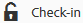

# [!DNL Experience Manager] デスクトップアプリケーション v1.10 の使用  {#use-aem-desktop-app-v1x}

デスクトップアプリケーションを使用すると、[!DNL Experience Manager] 内のアセットにローカルデスクトップから手軽にアクセスし、任意のデスクトップアプリケーションで利用できるようになります。アセットは Mac Finder や Windows エクスプローラーで容易に表示したり、デスクトップアプリケーションで開いたり、ローカルで変更したりできます。変更内容は [!DNL Experience Manager] に保存され、リポジトリー内に新しいバージョンが作成されます。

この統合により、Creative Cloud や他のアプリケーション全体でアセット管理とアクセスを一元化でき、ブランディングやその他の標準規格への準拠を確保できます。

[!DNL Experience Manager] デスクトップアプリケーション v1 を使用して行う主なタスクは次のとおりです。

1. [ [!DNL Experience Manager]  サーバーと接続する](#installandconnect)
1. [アセットをデスクトップアプリで直接開く](#openondesktop)
1. [アセットをデスクトップアプリから編集およびチェックアウトする](#workonassets)
1. [アセットおよびフォルダーを一括アップロードする](#bulkupload)

様々な推奨事項や注意事項については、[デスクトップアプリを使用する際のベストプラクティス](best-practices-for-v1.md)を参照してください。アプリケーションの使用時に問題が発生した場合は、[ [!DNL Experience Manager]  デスクトップアプリのトラブルシューティング](troubleshoot-app-v1.md)を参照してください。

>[!NOTE]
>
>デスクトップアプリケーションは [!DNL Experience Manager] 6.1 リリースで導入され、当初は [!DNL Experience Manager Assets Companion App] と呼ばれていました。

## クリエイティブワークフローでの [!DNL Experience Manager] デスクトップアプリケーションのタッチポイント {#aem-desktop-app-touch-points-in-the-creative-workflow}

[!DNL Experience Manager] デスクトップアプリケーションおよび [!DNL Assets] はクリエイティブワークフローで統合され、以下のタッチポイントが提供されます。

![[!DNL Experience Manager] デスクトップアプリケーションのタッチポイント（クリエイティブワークフロー）](assets/aem_desktopapp_workflow.png)

[!DNL Experience Manager] デスクトップアプリケーションのタッチポイント（クリエイティブワークフロー）

## アプリケーションのインストールと [!DNL Experience Manager] サーバーへの接続 {#installandconnect}

クリエイティブアセットの作成または編集を開始するには、まず、リポジトリーのアセットをダウンロードおよびアップロードするためにデスクトップアプリケーションを [!DNL Assets] サーバーに接続します。以下の作業をおこないます。

1. [アプリをインストールします](#installapp)。
1. [環境設定](#inapppref)および接続の詳細を設定します。
1. [ [!DNL Experience Manager]  サーバーに接続](#connect)し、アセットリポジトリーをローカルドライブとしてマウントします。
1. [!DNL Experience Manager] サーバーで[デスクトップアクションを有効](#desktopactions)にします。

[!DNL Experience Manager] デスクトップアプリケーションは HTTPS 接続を使用して [!DNL Experience Manager] サーバーに接続し、アセットを堅牢かつ安全に転送します。

>[!NOTE]
>
>インストールおよび設定手順の一部または全体で、[!DNL Experience Manager] 管理者またはシステム管理者のサポートが必要になることがあります。

### アプリケーションのインストール {#installapp}

Experience Manager デスクトップアプリを使用するには、アプリケーションが Experience Manager サーバーのバージョンをサポートしていることを確認してください。使用するオペレーティングシステム（Mac または Windows）に適したインストールファイル（バイナリ）をダウンロードして、アプリケーションをインストールします。

ネットワークおよびシステムの環境設定によっては、詳細な設定が必要になることがあります。詳しくは、[ [!DNL Experience Manager]  デスクトップアプリケーションのインストールと設定](install-configure-app-v1.md)を参照してください。

1. [[!DNL Experience Manager]  デスクトップアプリケーション v1.10 のダウンロードページ](/help/using/release-notes-of-v1.md)に移動し、オペレーティングシステムに適したバイナリをダウンロードします。
1. ダウンロードしたインストールファイルを実行し、画面上の指示に従ってアプリケーションをインストールします。

   >[!NOTE]
   >
   >インストールして一度にアクティブ化できる [!DNL Experience Manager] デスクトップアプリケーションのインスタンスは 1 つだけです。

### アプリケーション内のオプションと環境設定について {#inapppref}

アプリケーションでは、[!DNL Experience Manager] サーバーとの接続および切断、アップロードステータスの表示、ローカルキャッシュの管理などの設定を行うことができます。デフォルト設定は、アプリケーションの標準ユーザー向けです。設定を調節することで、アプリケーションをさらに活用したり、[!DNL Experience Manager] サーバーとの統合からさらに多くのメリットを得ることができます。様々な設定は次のとおりです。

**Explore Assets**：[!DNL Assets] リポジトリーをマウントしたローカルドライブを開きます。つまり、ローカルマシンで利用できるようになったアセットを参照します。

**View Asset Status**：変更したアセットを [!DNL Assets] リポジトリーにアップロードしたり、新しいアセットを追加したりするときは、アセットがバックグラウンドでアップロードされます。バックグラウンドで処理されるので、サイズの大きいアセットでもアップロード完了まで待つ必要がなくなり、円滑な作業が可能になります。ユーザーは変更内容をローカルで保存するだけです。これらのアセットをアプリケーションからサーバーに送信するには、ある程度の時間がかかります（利用可能な帯域幅によります）。アップロードのステータスや、その他いくつかの基本情報を確認できます。

**オプション** デスクトップアプリトレイのオプションをクリックして、起動時にアプリケーションを起動するように設定し、起動時に [!DNL Experience Manager] サーバーに接続します。取り付け後に [!DNL Assets] のローカルドライブ文字を変更します。

**Advanced／Manage Cache**：ローカルキャッシュに使用するディスク容量を管理できます。[!DNL Assets] サーバーのアーティファクトがローカルにキャッシュされ、スムーズに利用できるようになります。要件に応じてデフォルト設定を変更することができます。キャッシュをクリアして、すべてのアセットを取得し直すこともできます。キャッシュをクリアした場合でも、未保存の変更内容は維持されます。[!DNL Experience Manager] サーバーにチェックインしていないアセットは、削除されずにそのまま保持されます。

### [!DNL Experience Manager] サーバーへの接続  {#connect}

アプリは、Windows および Mac のプロキシ設定をサポートします。設定はアプリの起動時に読み込まれます。プロキシ設定を変更した場合は、変更を適用するためにアプリを再起動します。

>[!NOTE]
>
>プロキシ設定を変更した場合は、変更を適用するためにアプリを再起動します。それ以外の場合、アプリは設定済みのプロキシサーバーを引き続き使用します。

1. [!DNL Experience Manager] デスクトップアプリケーションを起動します。アプリケーションに [!DNL Experience Manager] インスタンスをマッピングするには、[!DNL Experience Manager] サーバーを `https://[aem-server-url]:[port]` の形式で指定します。

   ![Mac での認証と [!DNL Experience Manager] サーバー URL の提供](assets/aem_desktop_app_server_url.png)

1. ログイン画面で、インスタンスのユーザー名とパスワードを指定します。別の [!DNL Experience Manager] インスタンスを指定するには、「**[!UICONTROL Alternate Login URL]**」オプションを選択します。

   ![[!DNL Experience Manager] デスクトップアプリケーションのログイン画面での [!DNL Experience Manager] サーバーの資格情報の入力](assets/login_screen_v1.png)

### [!DNL Experience Manager] Web インターフェイスでのデスクトップアクションの有効化 {#desktopactions}

Assets ユーザーインターフェイスから、アセットの場所を参照したり、アセットをチェックアウトしてデスクトップアプリケーションで編集用に開いたりできます。これらのオプションはデスクトップアクションと呼ばれており、デフォルトでは有効になっていません。デスクトップアクションを有効にするには、以下の手順に従います。

1. Assets インターフェイスで、ツールバーの右上隅にあるユーザーアイコンをクリックまたはタップします。
1. 「**[!UICONTROL My Preferences]**」をクリックして、**[!UICONTROL Preferences]** ダイアログを表示します。

   ユーザーの環境設定を表示している ![[!DNL Experience Manager] インターフェイス](assets/aem_ui_user_preferences.png)

1. [!UICONTROL User Preferences]ダイアログで、「**[!UICONTROL Show Desktop Actions For Assets]**」を選択し、「**[!UICONTROL Accept]**」をクリックします。

   ![「[!UICONTROL Show Desktop Actions For Assets]」をオンにすると、デスクトップアクションが有効になります。](assets/enable_desktop_actions.png)

   *図：「[!UICONTROL Show Desktop Actions For Assets]」をチェックしてデスクトップアクションを有効化する。*

## デスクトップでのアセットへのアクセスとオープン {#openondesktop}

「**開く**」をクリックしてローカルコンピューターでアセットを開くと、アプリケーションの内部キャッシュにアセットがダウンロードされます。ダウンロードされたアセットのファイルタイプに関連付けられているネイティブデスクトップアプリケーションが起動されます。

Mac の場合は、コンテキストメニューで「**開く**」を選択し、[!DNL Experience Manager] デスクトップアプリケーションを通じてアセットを開きます。Windows の場合は、コンテキストメニューで「Open on Web」を選択してアセットを開きます。アセットステータスウィンドウでをクリックまたはタップして、アセットを開きます。

Adobe InDesign（INDD）ファイルでは、コンテキストメニューで「**[!UICONTROL Open]**」を選択します。このオプションをクリックすると、リンクされているアセットが AEM デスクトップアプリケーションによってローカルファイルシステムにダウンロードされ、Adobe InDesign で INDD ファイルが表示されます。この方法を使用することで、INDD ファイルを編集するときに必要なアセットをローカルで利用できます。

![[!DNL Experience Manager] デスクトップアプリケーションでアセットにアクセスして開くためのコンテキストメニューオプション](assets/aem_desktopapp_mac_context_menu.png)

*図：[!DNL Experience Manager] デスクトップアプリケーションでアセットにアクセスして開くためのコンテキストメニューオプション。*

>[!NOTE]
>
>Mac で Finder の表示オプションに移動し、マウントされた [!DNL Assets] フォルダーの「**Show item info**」、「**Show item preview**」、「**Show preview column**」の各オプションを無効にすることをお勧めします。それにより、パフォーマンスが向上します。

### [!DNL Experience Manager] インターフェイスのその他のオプション {#additional-options-in-aem-assets}

[!DNL Assets] リポジトリーをローカルドライブにマッピングした後で、マッピングされたアセットとフォルダーに対して追加のアイコンと「Folder Upload」機能が表示されるように設定できます。

1. [!DNL Assets] インターフェイスを開き、フォルダーまたはアセットの上にマウスポインターを置くと、デスクトップアクションがカード表示のクイックアクションとして表示されます。

   

   *図：Assets UI でクイックアクションメニューを開いてデスクトップアクションを表示する。*

   これらのデスクトップアクションは、アセットを選択した後のツールバー、またはアセットページにあるツールバーの「**Desktop Actions**」オプションをクリックしても使用できます。

1. 特定のファイル拡張子に関連付けられているデスクトップアプリケーションでアセットを表示するには、「**Open on desktop**」クイックアクション  をクリックします。

   または、ツールバーの&#x200B;**デスクトップアクション**&#x200B;メニューから「**Open**」を選択します。

ローカルファイルシステム上で特定のアセットを見つけるには、「**Reveal**」クイックアクション  をクリックします。または、ツールバーの&#x200B;**デスクトップアクション**&#x200B;メニューから「**Reveal**」を選択します。

## アセットのステータスについて {#understand-the-asset-statuses}

|  | AEM デスクトップアプリケーションはサーバーに接続されており、すべてのアセットが同期されています。 |
--- |--- |
|  | AEM デスクトップアプリケーションは起動していますが、サーバーに接続されていません。一部のアセットの同期が保留されている可能性があります。 |
|  | アセットの同期中です。ファイルはアップロード中またはダウンロード中です。Asset Status ウィンドウで、ステータスの詳細を確認し、転送を一時停止できます。 |
|  | AEM デスクトップアプリケーションは再接続を試みています。ネットワークの問題が発生し、切断された可能性があります。 |

## アセットの操作 {#workonassets}

### [!DNL Experience Manager] Web インターフェイスからのアセットのチェックアウト {#check-out-assets-from-the-aem-web-interface}

[!DNL Experience Manager Assets] では、編集のためにアセットをチェックアウトし、変更終了後にアセットをチェックインすることができます。アセットをチェックアウトした後は、その人だけがアセットを編集、注釈、公開、移動、削除できるようになります。アセットをチェックアウトすると、そのアセットがロックされ、他のユーザーはそのアセットに対する操作ができなくなります。アセットをチェックイン／チェックアウトするには、アセットへの書き込み権限が必要です。

[!DNL Experience Manager] Web インターフェイスからアセットをチェックアウトするには、2 つの方法があります。1 つ目の方法について詳しくは、[Assets UI からのファイルのチェックインとチェックアウト](https://experienceleague.adobe.com/ja/docs/experience-manager-65/content/assets/managing/check-out-and-submit-assets)を参照してください。[!DNL Experience Manager] デスクトップアプリケーションがインストールされている場合にアセットをチェックアウトして開く 2 つ目の方法を使用するには、以下の手順に従います。

1. [!DNL Assets] インターフェイスを開き、フォルダーまたはアセットの上にマウスポインターを置くと、デスクトップアクションがカード表示のクイックアクションとして表示されます。

   

   これらのデスクトップアクションは、アセットを選択した後のツールバー、またはアセットページにあるツールバーの「Desktop Actions」アイコンをクリックまたはタップしても使用できます。

1. アセットを開くには、「Open on desktop」クイックアクション  をクリックまたはタップします。

   または、ツールバーのデスクトップアクションメニューから「Open」を選択します。

   >[!NOTE]
   >
   >開いているがチェックアウトされていないファイルを編集する際、他のユーザーにはアセットが更新されていることがわかりません。

1. アセットを開いて Adobe Creative Cloud アプリケーションで編集するには、 をクリックします。また、このオプションでは、編集用にアセットもチェックアウトされます。編集が終了したら、アセットをチェックインして、[!DNL Assets] で変更を更新します。

   または、ツールバーのデスクトップアクションメニューから「Edit」を選択します。

1. 「Open」メニューオプションを選択します。選択したアセットがプレビューモードで開きます。
1. アセットを編集するには、「Edit」オプションを選択します。選択したアセットが編集モードで開きます。

### macOS の Finder からのアセットのチェックアウト {#check-out-assets-on-mac}

AEM デスクトップアプリケーションでは、作業中のファイルが他のユーザーによって変更されないように、アセットファイルをチェックアウトできます。

1. Mac のコンテキストメニューで「AEM Assets フォルダーを開く」オプションを選択して Finder を開きます。

   ![[!DNL Experience Manager] デスクトップアプリケーションでアセットにアクセスして開くためのコンテキストメニューオプション](assets/aem_desktopapp_mac_context_menu.png)

   *図：[!DNL Experience Manager] デスクトップアプリケーションでアセットにアクセスして開くためのコンテキストメニューオプション。*

1. チェックアウトするアセットに移動します。
1. アセットを右クリックし、コンテキストメニューの「More Assets Info」を選択します。
1. Asset Info ダイアログで、「Checkout」アイコンをクリックまたはタップして、アセットをチェックアウトします。「Checkout」アイコンは、クリックまたはタップすると、「Check-in」アイコンに変わります。

   

1. 他のユーザーが使用できるようにアセットをチェックインするには、Asset Info ダイアログの「Check-in」アイコンをクリックまたはタップします。

### アセットのチェックアウト（Windows の場合） {#check-out-assets-on-windows}

AEM デスクトップアプリケーションでは、作業中のファイルが他のユーザーによって変更されないように、アセットファイルをチェックアウトできます。

1. コンテキストメニューの「アセットを探す」を選択してエクスプローラーを開きます。
1. エクスプローラーで、チェックアウトするアセットの場所に移動します。
1. アセットを右クリックし、コンテキストメニューの「Web で開く」を選択します。
1. アセット情報ダイアログで、チェックアウトアイコンをクリックします。チェックアウトアイコンがチェックインアイコンに変わります。

   

1. エクスプローラーでアセットを確認します。アセットのロックアイコン  は、このアセットをチェックアウトしていることを示します。

   >[!NOTE]
   >
   >ロックアイコンは、少し遅れて表示される場合があります。[!DNL Experience Manager] デスクトップアプリケーションは、すばやくアクセスできるようにアセットをキャッシュするので、ロック済みのステータスが更新されるまでにしばらく時間がかかることがあります。

1. 他のユーザーが使用できるようにアセットをチェックインするには、**Asset Info** ダイアログの「Check-in」アイコンをクリックまたはタップします。

### Finder またはエクスプローラー、および Web インターフェイスを使用したアセットのチェックイン {#check-in-an-asset-using-finder-or-explorer-and-using-web-interface}

アセットの編集が終了したら、デスクトップアプリケーションでアセットを保存します。コンテキストメニューで「**More Assets Info**」を選択して、「Check-in」をクリックします。

アセットが [!DNL Experience Manager] サーバーにアップロードされます。オプションで、システムトレイアイコンから「**View Asset Status**」を選択して、アップロードのステータスを確認できます。または、[!DNL Experience Manager] Web インターフェイスからアセットをチェックインすることもできます。チェックアウトされたアセットをクリックするか選択します。ツールバーのチェックインアイコン  をクリックします。

変更内容がローカルに保存された後、アセットが [!DNL Experience Manager] に自動的にアップロードされます。このチェックイン操作により、他の [!DNL Experience Manager] ユーザーがアセットを編集できるようになります。

### [!DNL Experience Manager] サーバーへのアセットおよびフォルダーの一括アップロード {#bulkupload}

[!DNL Experience Manager] デスクトップアプリケーションでは、アセットを含むフォルダー全体をローカルファイルディレクトリから [!DNL Assets] にアップロードできます。この方法では、フォルダー内のすべてのアセットが一度にアップロードされ、ファイルを 1 つずつアップロードする必要はありません。

1. Assets UI で、ツールバーの「**作成**」をクリックまたはタップし、メニューから「**フォルダーをアップロード**」を選択します。
1. アップロードするフォルダーに移動し、そのフォルダーを選択します。
1. 「OK」をクリックまたはタップします。アセットステータスダイアログにアップロードのステータスが表示されます。

   

   アセットステータスウィンドウでのアップロードのステータスの確認

   >[!NOTE]
   >
   >該当するアイコンをクリックまたはタップして、アップロードを手動で一時停止またはキャンセルすることができます。

1. フォルダーがアップロードされたら、ダイアログを閉じて、Asssets UI に移動します。アップロードされたフォルダーが web インターフェイスに表示されます。

アドビでは、多数のファイルやネストしたフォルダーをローカルファイルシステムからネットワーク共有領域にコピー＆ペーストしたりドラッグしたりしないことをお勧めします。技術的な制限により、アプリがアップロード処理を制御できず、パフォーマンスも低下するからです。

または、Finder やエクスプローラーでファイル／フォルダーを選択してコピーし、ネットワーク共有領域の対象フォルダーに移動して、[!DNL Experience Manager] デスクトップアプリケーションのコンテキストメニューから「**アセットをペースト**」を選択します。この場合、[!DNL Experience Manager] デスクトップアプリケーションは、[!DNL Experience Manager] web インターフェイスで使用できる「**フォルダーをアップロード**」オプションと同じように、ペーストしたアセットのアップロードを開始します。

>[!MORELIKETHIS]
>
>* [ [!DNL Experience Manager]  デスクトップアプリケーションのトラブルシューティング](troubleshoot-app-v1.md)
