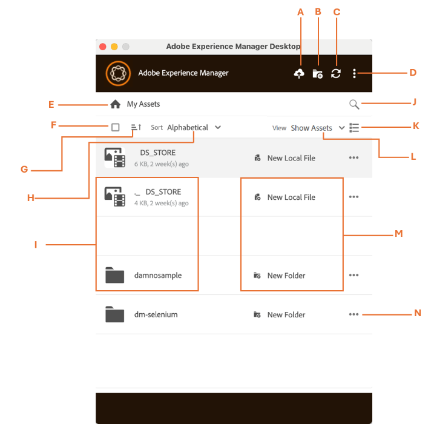

# [!DNL Adobe Experience Manager] デスクトップアプリケーションのユーザーインターフェイス {#user-interface-desktop-app}

[!DNL Adobe Experience Manager] デスクトップアプリケーションは、直観的で使いやすいユーザーインターフェイスを提供しています。 すっきりしたインターフェイスのおかげで、アセットや関連情報を見つけやすく覚えやすくなります。

[!DNL Adobe Experience Manager] デスクトップアプリケーションにログインすると、次のインターフェイスが表示されます。

<table border="0">
    <tr>
        <td> A </td>
        <td> アセットを追加 </td>
    </tr>
    <tr>
        <td> B </td>
        <td> ディレクトリまたはフォルダーを作成 </td>
    </tr>
    <tr>
        <td> C </td>
        <td> アセットの更新または再接続 </td>
    </tr>
    <tr>
        <td> D </td>
        <td> 次のようなその他のオプション：
            <ul>
                <li>環境設定</li>
                <li>web 内で開く</li>
                <li>Cookie のクリア</li>
                <li>作業フォルダーを表示</li>
                <li>ヘルプ</li>
                <li>ログアウト</li>
                <li>終了</li>
            </ul>
        </td>
    </tr>
    <tr>
        <td> E </td>
        <td> マイアセット（アプリケーションのホームページを示します） </td>
    </tr>
    <tr>
        <td> F </td>
        <td> すべてのチェックボックスを選択 </td>
    </tr>
    <tr>
        <td> G </td>
        <td> 昇順または降順で並べ替え </td>
    </tr>
    <tr>
        <td> H </td>
        <td> アルファベット順、サイズ順、最終変更日で並べ替え </td>
    </tr>
    <tr>
        <td> I </td>
        <td> 
        <ul>
            <li> <b>ファイルオプション：</b>ファイルを開くまたはファイルをアップロード </li> 
            <li> <b> フォルダーオプション：</b> フォルダーを表示 </li>
        </ul>
        </td>
    </tr>
    <tr>
        <td> J </td>
        <td> アセットを検索 </td>
    </tr>
    <tr>
        <td> K </td>
        <td> 
            <ul>
                <li> <b>リスト表示：</b>ツリー表示では、スクロール可能なファイルとフォルダーが 1 列に表示されます。 </li> 
                <li> <b>グリッド表示：</b>グリッド表示では、スクロール可能なファイルとフォルダーが行と列のグリッドに表示されます。 </li>
                <li> <b>カード表示：</b>カード表示は、コンテンツを整理して、すっきりとした境界付きのクリック可能なブロックとして表示するコンパクトなレイアウトです。 </li> 
            </ul>
        </td>
    </tr>
    <tr>
        <td> L </td>
        <td> 次のような表示オプションがあります。 
            <ul>
                <li><b>すべてのアセットを表示：</b>すべてのアセットを表示できます。 </li>
                <li><b>コレクションを表示：</b>ネイティブの AEM アプリケーションで作成されたすべてのコレクションを表示できます。 その他のコレクションを参照してください。 </li>
                <li><b>ローカルで編集：</b>ローカルで変更されたすべてのアセットを表示できます。 このビューでは、複数のアセットを追加およびアップロードできます。</li>
                <li><b>アセットを転送：</b>ネイティブアプリからローカルに、またはその逆に転送されたすべてのアセットを表示できます。 </li>
                <li><b>ピン留めされた項目：</b>ピン留めされたすべての項目を表示できます。</li>
            </ul>
        </td>
    </tr>
    <tr>
        <td> M </td>
        <td> ファイルまたはフォルダー（ローカルまたは web）のインジケーター。 </td>
    </tr>
    <tr>
        <td> × </td>
        <td> その他のオプション： 
            <ul>
                <li><b>ダウンロード：</b>選択したアセットまたはフォルダーをダウンロードできます。 </li>
                <li><b>コピーをダウンロード：</b>選択したアセットまたはフォルダーのコピーをダウンロードできます。このコピーは、オフラインで使用するために重複として保存されます。 </li>
                <li><b>フォルダーを表示：</b>これを使用して、システムのファイルエクスプローラーでフォルダーを開きます。</li>
                <li><b>ピン留め：</b>選択したアセットをピン留めまたはピン留めを解除できます。 </li>
                <li><b> フォルダーメタデータスキーマの適用：</b>このオプションを使用すると、構造化されたメタデータスキーマをアセットに適用でき、一貫した整理、検索性、管理が可能になります。</li>
                <li><b>フォルダープロパティの表示：</b>フォルダーに関連付けられた詳細なメタデータと属性が表示されます。 </li>
                <li><b>web で開く：</b>web ブラウザーインターフェイスから直接フォルダーにアクセスして表示します。 </li>
                <li><b>削除：</b>選択したアセットとそのコンテンツを削除します。 </li>
                <li><b>名前を変更：</b>選択したアセットの名前を新しいユーザー定義名に変更します </li>
            </ul>
        </td>
    </tr>
</table>

## [!DNL Adobe Experience Manager] デスクトップアプリケーションのフォルダー構造の表示 {#folder-structure-desktop-app}

フォルダーに移動し、フォルダー名の横にあるアイコンをクリックします。 **[!UICONTROL Reveal Folder]** を選択すると、システムのエクスプローラーでフォルダーをすぐに開き、そのコンテンツにすばやく直接アクセスでき、ナビゲーションや管理が簡単になります。

## 次の手順 {#next-steps}

* [Adobe Experience Manager デスクトップアプリの使用を開始するビデオを見る](https://experienceleague.adobe.com/ja/docs/experience-manager-learn/assets/creative-workflows/aem-desktop-app)

* 右側のサイドバーにある「[!UICONTROL Edit this page]」または「[!UICONTROL Log an issue]」を使用してドキュメントに関するフィードバックを提供する

* [カスタマーケア](https://experienceleague.adobe.com/ja?support-solution=General#support)に問い合わせる

>[!MORELIKETHIS]
>
>* [デスクトップアプリケーションでのアセットの検索](/help/using/assets-management-tasks.md)
>* [アセットのダウンロード](/help/using/download-assets.md)
>* [アセットのアップロード](/help/using/upload-assets.md)
