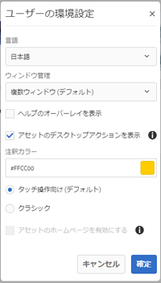
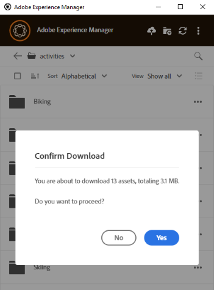
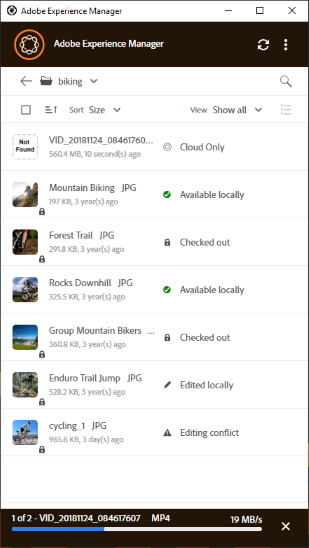

# [!DNL Adobe Experience Manager] デスクトップアプリケーションの使用 {#use-aem-desktop-app-v2}

の使用 [!DNL Adobe Experience Manager] に保存されたデジタルアセットにアクセスするためのデスクトップアプリケーション [!DNL Adobe Experience Manager] ローカルデスクトップ上の DAM リポジトリ。 その後、これらのアセットを任意のデスクトップアプリケーションで使用できます。 デスクトップアプリケーションでアセットをローカルに開いて編集できます。 変更を加えたら、それらをにアップロードして戻します [!DNL Experience Manager] 他のユーザーと更新を共有するためのバージョン管理を備えています。 また、新しいファイルおよびフォルダー階層を [!DNL Experience Manager] にアップロードしたり、フォルダーを作成したり、[!DNL Experience Manager] DAM からアセットやフォルダーを削除したりすることもできます。

この統合により、組織内の様々な役割がアセットをで一元管理できるようになります [!DNL Experience Manager Assets] Windows またはmacOSのネイティブアプリケーションでローカルデスクトップ上のアセットにアクセスする場合も同様です。

ログアウト後または初めてアプリケーションを開くときに、[!DNL Experience Manager] サーバーの URL を `https://[aem-server-url]:[port]/` の形式で指定します。次に、「[!UICONTROL Connect]」オプションを選択します。アプリケーションをサーバーに接続するための認証情報を入力します。

を使用して実行する主なタスク [!DNL Adobe Experience Manager] デスクトップアプリケーションは次のとおりです。

![[!DNL Experience Manager] デスクトップアプリケーションを使用して実行できるワークフローとタスク](assets/aem_desktop_app_usecases_v2.png " [!DNL Adobe Experience Manager] デスクトップアプリケーションを使用して実行できるワークフローとタスク")

[この](assets/aem_desktop_app_usecases_print.pdf)印刷用 PDF ファイルをダウンロードします。

## デスクトップアプリケーションの動作の仕組み {#how-app-works2}

アプリケーションの使用を開始する前に、次を理解します [アプリの仕組み](release-notes.md#how-app-works). また、次の用語についても把握しておいてください。

* **[!UICONTROL Desktop Actions]**:Assets web インターフェイスおよびブラウザー内から、アセットの場所を参照したり、アセットをチェックアウトしてネイティブデスクトップアプリケーションで編集用に開いたりできます。 これらのアクションは Web インターフェイスから使用でき、デスクトップアプリケーション機能を使用します。 詳しくは、[デスクトップアクションを有効にする方法](using.md#desktopactions-v2)を参照してください。

* ファイルのステータスが「**[!UICONTROL Cloud Only]**」：アセットはローカルマシンにはダウンロードされず、[!DNL Experience Manager] サーバー上でのみ使用可能です。

* ファイルのステータスが「**[!UICONTROL Available locally]**」：アセットはローカルマシンにダウンロードされ、そのまま使用できます。ただし、アセットは変更されません。

* ファイルのステータスが「**[!UICONTROL Edited locally]**」：アセットはローカルに編集され、変更内容は [!DNL Experience Manager] サーバーにアップロードされた後も保持されます。アップロード後、ステータスは「[!UICONTROL Available locally]」に変わります。詳しくは、[アセットの編集](using.md#edit-assets-upload-updated-assets)を参照してください。

* ファイルのステータス : **[!UICONTROL Editing conflict]**：自分と他のユーザーがアセットを同時に編集した場合、アプリは編集の競合が発生したことを示します。 また、変更内容を保持するか破棄するかの選択肢も提示されます。詳しくは、[編集上の競合の回避方法](using.md#adv-workflow-collaborate-avoid-conflicts)を参照してください。

* ファイルのステータスが「**[!UICONTROL Modified remotely]**」：ダウンロードしたアセットが [!DNL Experience Manager] サーバー上で変更されたことをデスクトップアプリケーションが知らせます。また、最新バージョンをダウンロードするか、ローカルコピーを更新するかの選択肢も提示されます。詳しくは、[編集上の競合の回避方法](using.md#adv-workflow-collaborate-avoid-conflicts)を参照してください。

* **[!UICONTROL Check-out]**：ファイルを編集しようとしている場合やファイルを編集する予定である場合は、ステータスをチェックアウトに切り替えます。アプリのアセットにロックアイコンが追加され、 [!DNL Experience Manager] Web インターフェイス。 ロックアイコンは、編集上の競合が発生するため、同じアセットを同時に編集しないように他のユーザーに指示する働きをします。

* **[!UICONTROL Check-in]**：編集上の競合が発生することなく他のユーザーが安全にアセットを編集できることを知らせます。変更内容をアップロードすると、ロックアイコンは自動的に削除されます。チェックインステータスを切り替えるとロックアイコンも削除されますが、Adobeでは、変更内容をアップロードせずに手動でチェックインしないことをお勧めします。 変更内容を破棄した場合は、手動でチェックインに切り替えます。

* 「**[!UICONTROL Open]**」アクション：アセットを開いて、ネイティブアプリケーションでプレビューするだけです。Adobeでは、この操作を使用してアセットを編集しないことをお勧めします。 アセットがチェックアウトされないからです。 一方、他のユーザーが編集を行うと、編集の競合が発生する可能性があります。

* 「**[!UICONTROL Edit]**」アクション：アセットを編集できます。クリック [!UICONTROL Edit] アセットをチェックアウトし、アセットにロックアイコンを追加します。 このアクションをクリックした後、アセットを編集しない場合は、「[!UICONTROL Toggle check-in]」をクリックします。でアセットを削除、名前変更、移動するには [!DNL Experience Manager] DAM フォルダー階層、使用 [!DNL Experience Manager] 編集アクションではなく、web インターフェイスアクション。

* 「**[!UICONTROL Download]**」アクション：アセットをローカルマシンにダウンロードします。アセットをすぐにダウンロードし、後で編集できます。オフラインで作業し、後で変更内容をアップロードすることができます。アセットは、ファイルシステム上のキャッシュフォルダーにダウンロードされます。

* **[!UICONTROL Reveal File]** または **[!UICONTROL Reveal Folder]** アクション：アセットがローカルキャッシュフォルダーにダウンロードされる間、アプリはローカルネットワークドライブを模倣します。 各アセットのローカルパスを提供します。 このパスを確認するには、デスクトップアプリケーションで適切な表示オプションを使用します。Creative Cloud アプリケーションにアセットを配置するには、このアクションが必要です。詳しくは、[アセットの配置](using.md#place-assets-in-native-documents)を参照してください。

* **[!UICONTROL Open In Web]** アクション：でアセットを表示するには [!DNL Experience Manager] Web インターフェイス、Web で開きます。 から追加のワークフローを開始できます [!DNL Experience Manager] メタデータの更新やアセット検出などのインターフェイス。

* **[!UICONTROL Delete]** アクション：[!DNL Experience Manager] DAM リポジトリーからアセットを削除します。このアクションで、Adobe Experience Manager サーバーにあるアセットの元のコピーが削除されます。ローカルアセットへの変更の破棄のみを行う場合は、を参照してください。 [変更を破棄](using.md#edit-assets-upload-updated-assets).

* **[!UICONTROL Upload Changes]**：デスクトップアプリケーションはに明示的にアップロードした場合にのみ、更新されたアセットをアップロードします。 [!DNL Experience Manager] サーバー。 編集内容を保存しても、変更内容はローカルマシンにのみ保存されます。アップロードすると、アセットは自動的にチェックインされ、ロックアイコンは削除されます。 詳しくは、[アセットの編集](using.md#edit-assets-upload-updated-assets)を参照してください。

## でデスクトップアクションを有効にする [!DNL Experience Manager] Web インターフェイス {#desktopactions-v2}

ブラウザーの [!DNL Assets] ユーザーインターフェイスから、アセットの場所を参照したり、アセットをチェックアウトしてデスクトップアプリケーションで編集用に開いたりできます。これらのオプションは「[!UICONTROL Desktop Actions]」と呼ばれ、デフォルトでは有効になっていません。有効にするには、次の手順に従います。

1. [!DNL Assets] コンソールで、ツールバーの「**[!UICONTROL User]**」アイコンをクリックします。
1. 「**[!UICONTROL My Preferences]**」をクリックして、**[!UICONTROL Preferences]** ダイアログを表示します。

1. [!UICONTROL User Preferences]ダイアログで、「**[!UICONTROL Show Desktop Actions For Assets]**」を選択し、「**[!UICONTROL Accept]**」をクリックします。

   

   *図：を選択 [!UICONTROL Show Desktop Actions For Assets] デスクトップアクションを有効にします。*

## アセットの参照、検索、プレビュー {#browse-search-preview-assets}

[!DNL Experience Manager] リポジトリーで使用可能なアセットをデスクトップアプリケーション内から参照、検索およびプレビューできます。それには、デスクトップアプリケーションで以下を行います。

1. フォルダーを参照し、そのフォルダー内で使用可能なアセットの基本情報と、すべてのアセットの小さなサムネールを確認します。

   

1. 個々のアセットの詳細情報と大きいサムネールを表示するには、ファイル名をクリックします。

   

1. 「**[!UICONTROL Open]**」または「**[!UICONTROL Edit]**」をクリックすると、ファイルがローカルにダウンロードされ、それぞれネイティブアプリケーションでファイルを表示または編集することができます。
1. キーワードを使用して検索すると、[!DNL Experience Manager] リポジトリー内の関連アセットを見つけることができます。`?` や `*` をワイルドカードとして使用します。これらのワイルドカードは、それぞれ 1 文字または複数文字に置き換えられます。必要に応じて、検索結果をフィルタリングしたり並べ替えたりします。

   

   

>[!NOTE]
>
>デスクトップアプリケーションは、アセットのタイトルやファイル名だけでなく、複数のメタデータフィールドを検索条件と照合してアセットを表示します。

## アセットのダウンロード {#download-assets}

アセットはローカルファイルシステムにダウンロードできます。アプリはからアセットを取得します [!DNL Experience Manager] サーバーを実行し、同じコピーをローカルファイルシステムに保存します。

 アイコンをクリックし、 アイコンをクリックしてダウンロードします。

>[!NOTE]
>
>大きなファイルまたは多数のファイルをダウンロードまたはアップロードするときは、アセットやフォルダーに対するアクションが無効になります。これらのアクションは、ダウンロードまたはアップロードが完了すると使用可能になります。

キューサイズが大きい場合や、ネットワークに何らかの問題が発生した場合、複数のアセットをダウンロードすると、パフォーマンスが低下する可能性があります。 また、フォルダーのダウンロード時には、知らないうちに、ダウンロードするアセットを多数キューに入れてしまう場合もあります。長い待ち時間を避けるために、アプリではダウンロードするアセットの数を 1 回で制限しています。 その設定方法については、[環境設定の指定](install-upgrade.md#set-preferences)を参照してください。この制限を下回っていても、明らかに大きなフォルダーをダウンロードする場合は、その前に確認が求められることがあります。

フォルダーを選択してダウンロードする場合、アプリケーションは内のフォルダーに直接保存されたアセットのみをダウンロードします。 [!DNL Experience Manager]. サブフォルダー内のアセットが自動的にダウンロードされることはありません。

## デスクトップでアセットを開く {#openondesktop-v2}

リモートアセットを開いて、ネイティブアプリケーションで表示することができます。アセットがローカルフォルダーにダウンロードされます。 その後、ファイル形式に関連付けられたネイティブアプリケーションで起動されます。 ネイティブアプリケーションを変更して、Mac または Windows で特定のファイルタイプ（拡張子）のアセットを開くことができます。

アセットメニューから「**[!UICONTROL Open]**」を選択します。アセットがローカルにダウンロードされ、ネイティブアプリケーションで開かれます。大きなアセットの場合は、ステータスバーでダウンロードの進行状況と転送速度を確認します。

<!-- 
-->

>[!NOTE]
>
>期待した変更がデスクトップアプリケーションに反映されない場合は、更新アイコン  をクリックするか、デスクトップアプリケーションインターフェイスで右クリックし、「**[!UICONTROL Refresh]**」を選択します。大量のダウンロードまたはアップロードが進行中の間、これらのアクションは使用できません。

アセットのローカルダウンロードフォルダーを開くには、、 「**[!UICONTROL Reveal File]**」アクションの順にクリックします。

## ネイティブドキュメントへのアセットの配置 {#place-assets-in-native-documents}

ネイティブドキュメントにアセットを配置する場合は、Windows エクスプローラーまたは Mac Finder でファイルにアクセスします。ローカルにダウンロードしたファイルのファイルシステム上の場所に移動するには、 「**[!UICONTROL Reveal File]**」オプションを使用します。

クリック **[!UICONTROL Reveal File]**、または **[!UICONTROL Reveal Folder]** フォルダーで、ローカルコンピューター上で事前に選択されたファイルまたはフォルダーを使用して Windows エクスプローラーまたはMac Finder を開きます。 例えば、オプションは、 [!DNL Experience Manager] ローカルファイルの配置またはリンクをサポートするネイティブアプリケーション内のファイル。 Adobe InDesign にファイルを配置する方法については、[グラフィックの配置](https://helpx.adobe.com/jp/indesign/using/placing-graphics.html)を参照してください。

この **[!UICONTROL Reveal File]** アクションを実行すると、ローカル ネットワーク共有が開きます。 ローカルで使用可能なアセットのみが表示されます。 つまり、アプリを使用して公開、ダウンロード、または開いた/編集されたアセットが表示されます。 ローカルネットワーク共有からは、変更内容が [!DNL Experience Manager] にアップロードされません。変更をアップロードするには、を明示的に使用します **[!UICONTROL Upload Changes]** または **[!UICONTROL Upload]** アプリ内のアクション。

>[!NOTE]
>
>[!DNL Experience Manager] デスクトップアプリケーション v1.x との下位互換性を保つため、表示されるファイルはローカルネットワーク共有から提供され、ローカルで使用可能なファイルのみ公開されます。表示されるファイルのデスクトップパスは、デスクトップアプリケーション v1.x で作成されたパスと同じです。

>[!CAUTION]
>
>を使用しないでください。 **[!UICONTROL Reveal File]** ネイティブアプリケーションでアセットを編集するオプション。 代わりに、「**[!UICONTROL Edit]**」アクションを使用します。詳しくは、を参照してください。 [高度なワークフロー：同じファイルに対する共同作業と編集上の競合の回避](#adv-workflow-collaborate-avoid-conflicts).

## アセットの編集と [!DNL Experience Manager] への更新済みアセットのアップロード {#edit-assets-upload-updated-assets}

変更する場合はアセットを開いて編集し、更新されたアセットをにアップロードします。 [!DNL Experience Manager] サーバー。 他のユーザーの編集内容と競合しないように、デスクトップアプリケーションを使用して編集セッションを開始します。編集を開始する前に、別のユーザーがアセットを編集していることを示すロックアイコンがアセットに表示されていないことを確認します。

アセットを編集するには、該当するアセットを検索するか、アセットの場所を参照します。 アイコンをクリックし、「**[!UICONTROL Edit]**」をクリックします。

次のどちらの状況でも、他のユーザーの編集と競合しないように、「**[!UICONTROL Toggle Check-out]**」を使用してアセットをロックします。

* 先にアセットをチェックアウトせずに（例えば単に開いて）アセットの編集を開始した。
* アセットの編集をすぐに開始するつもりであり、他のユーザーには編集されないようにしたい。

編集が完了すると、変更したアセットのステータスが「**[!UICONTROL Edited Locally]**」としてデスクトップアプリケーションに表示されます。アセットに保存した変更は、[!DNL Experience Manager] にアップロードするまでは、すべてローカルのみの変更になります。個々のアセットまたは複数のアセットを 1 つずつアップロードするには、アセットのオプションから「**[!UICONTROL Upload Changes]**」をクリックします。そのアセットの 1 つのバージョンが [!DNL Experience Manager] に作成されます。の web インターフェイスの使用 [!DNL Assets]を選択すると、でアセット履歴を確認できます。 [タイムライン表示](https://experienceleague.adobe.com/en/docs/experience-manager-65/content/assets/using/activity-stream).

共同編集に関するベストプラクティスについては、を参照してください。 [高度なワークフロー：同じファイルに対する共同作業と編集上の競合の回避](#adv-workflow-collaborate-avoid-conflicts).

次の場合は、ローカルアセットに対する変更や編集を破棄することができます。「**[!UICONTROL Discard Changes]**」をクリックします。

* で変更内容をローカルに保存しない場合 [!DNL Experience Manager].
* 変更内容を保存した後、元のアセットに対する変更を開始した場合。
* 必要なくなったのでアセットの編集を停止した場合。

必要に応じて、チェックアウトを切り替えます。更新されたアセットがローカルキャッシュフォルダーから削除され、編集時または開く際に再度ダウンロードされます。

## [!DNL Experience Manager] への新しいアセットのアップロードと追加 {#upload-and-add-new-assets-to-aem}

ユーザーは、DAM リポジトリーに新しいアセットを追加できます。例えば、代理店のフォトグラファーや請負業者は、撮影した大量の写真を [!DNL Experience Manager] リポジトリーに追加したいと考えるかもしれません。新しいコンテンツを [!DNL Experience Manager] に追加するには、アプリの上部バーにある  をクリックします。ローカルファイルシステム内のアセットファイルを参照し、「**[!UICONTROL Select]**」をクリックします。または、アプリケーションインターフェイス上でファイルまたはフォルダーをドラッグしてアセットをアップロードします。Windows では、アプリ内のフォルダーにアセットをドラッグすると、そのアセットがフォルダーにアップロードされます。アップロードに時間がかかる場合、アプリには進行状況バーが表示されます。

<!-- 
-->

ローカルファイルシステムからフォルダーや個々のファイルをアップロードできます。フォルダーの階層はアップロード時に保持されます。アセットを一括でアップロードする場合は、まず[バルクアップロード](#bulk-upload-assets)を参照してください。

特定のセッションで転送されたアセットのリストを表示するには、**[!UICONTROL View]**／**[!UICONTROL Assets transfers]** を選択します。このリストを見れば、現在のセッションのファイル転送をざっと確認できます。

**[!UICONTROL Preferences]**／**[!UICONTROL Upload acceleration]** の設定で、アップロードの同時実行性（高速化）を制御できます。通常は、同時実行性が高いほど、アップロードが高速になりますが、その反面、リソースの消費が大きくなり、ローカルマシンで消費される処理能力が増える可能性があります。システムの処理速度が低下した場合は、同時実行性の設定値を低くして、アップロードを再度試みます。

>[!NOTE]
>
>転送リストは永続的なものではなく、デスクトップアプリケーションを終了して再度開いた場合は使用できません。

### アセット名の特殊文字の管理 {#special-characters-in-filename}

レガシーアプリでは、ユーザーが指定したフォルダー名のスペースと大文字／小文字の区別をそのまま使用した名前のノードが、リポジトリー内に作成されます。現在のアプリケーションでv1.10アプリケーションのノード命名規則をエミュレートするには、「[!UICONTROL Preferences]」で「[!UICONTROL Use legacy conventions when creating nodes for assets and folders]」を有効にします。[アプリケーションの環境設定](/help/using/install-upgrade.md#set-preferences)を参照してください。このレガシー環境設定は、デフォルトでは無効になっています。

>[!NOTE]
>
>アプリケーションは、次の命名規則を使用して、リポジトリ内のノード名のみを変更します。デスクトップアプリケーションは、アセットの`Title`をそのまま保持します。

<!-- TBD: Do NOT use this table.

| Where do characters occur | Characters | Legacy preference | Renaming convention | Example |
|---|---|---|---|---|
| In file name extension | `.` | Enabled or disabled | Retained as is | NA |
| File or folder name | `. / : [ ] | *` | Enabled or disabled | Replaced with a `-` (hyphen) | `myimage.jpg` remains as is and `my.image.jpg` changes to `my-image.jpg`. |
| Folder name | `% ; # , + ? ^ { } "` | Disabled | Replaced with a `-` (hyphen) | tbd |
| File name | `% # ? { } &` | Disabled | Replaced with a `-` (hyphen) | tbd |
| File name | Whitespaces | Enabled or disabled | Retained as is | NA |
| Folder name | Whitespaces | Disabled | Replaced with a `-` (hyphen) | tbd |
| File name | Uppercase characters | Disabled | Retained as is | tbd |
| Folder name | Uppercase characters | Disabled | Replaced with a `-` (hyphen) | tbd |
-->

| 文字数‡ | アプリ内のレガシーの環境設定 | ファイル名で使用する場合 | フォルダー名で使用する場合 | 例 |
|---|---|---|---|---|
| `. / : [ ] \| *` | 有効または無効 | `-`（ハイフン）に置き換えられます。ファイル名拡張子の `.`（ドット）は、そのまま保持されます。 | `-`（ハイフン）に置き換えられます。 | `myimage.jpg` は保持され、は保持されます `my.image.jpg` 変更先 `my-image.jpg`. |
| `% ; # , + ? ^ { } "` および空白 | 無効 | 空白は保持されます | `-`（ハイフン）に置き換えられます。 | `My Folder.` が `my-folder-` に変更されます。 |
| `# % { } ? & .` | 無効 | `-`（ハイフン）に置き換えられます。 | 該当なし。 | `#My New File.` が `-My New File-` に変更されます。 |
| 大文字 | 無効 | 大文字／小文字はそのまま保持されます。 | 小文字に変更されました。 | `My New Folder` が `my-new-folder` に変更されます。 |
| 大文字 | 有効 | 大文字／小文字はそのまま保持されます。 | 大文字／小文字はそのまま保持されます。 | 該当なし。 |

‡文字のリストは空白で区切られたリストです。

<!-- TBD: Check if the following is to be included in the footnote.

Do not use &#92;&#92; in the names of files and &#92;&#116; &#38; in the names of folders. 
-->

<!-- TBD: Securing the below presentation of the same content in a comment.

**File names**

| Characters | Replaced by |
|---|---|
| &#35; &#37; &#123; &#63; &#125; &#38; &#46; &#47; &#58; &#91; &#124; &#93; &#42; | hyphen (-) |
| whitespaces | whitespaces are retained |
| capital case | casing is retained |

>[!CAUTION]
>
>Avoid using &#92;&#92; in file names.

**Folder names**

| Characters | Replaced by |
|---|---|
| Characters | Replaced by |
| &#37; &#59; &#35; &#44; &#43; &#63; &#94; &#123; &#123; &#34; &#46; &#47; &#59; &#91; &#93; &#124; &#42; | hyphen (-) |
| whitespaces | hyphen (-) |
| capital case | lower case |

>[!CAUTION]
>
>Avoid using &#92;&#92; &#92;&#116; &#38; in folder names.

>[!NOTE]
>
>If you enable [!UICONTROL Use legacy conventions when creating nodes for assets and folders] in app [!UICONTROL Preferences], then the app emulates v1.10 app behavior when uploading folders. In v1.10, the node names created in the repository respect spaces and casing of the folder names provided by the user. For more information, see [app Preferences](/help/using/install-upgrade.md#set-preferences).

-->

## 複数アセットの操作 {#work-with-multiple-assets}

ユーザーは、1 回の操作ですべての編集内容をアップロード、またはネストしたフォルダーを数回のクリックでアップロードするといったアクションを使用して、複数のアセットを容易に操作および管理することができます。

### 大きいフォルダーの参照 {#browse-large-folders}

多数のアセットを含んだフォルダーを操作する場合は、スクロールしてさらにアセットを表示します。キーボードを使用してスクロールするには、tab キーを数回押して、上部のアセットを選択します。 選択されたアセットが強調表示されます。ここで、下向き矢印キーを使用して、アセットのリスト内を移動します。

### 選択したアセットに対するクイックアクション {#quick-actions-for-selected-assets}

いくつかのアセットのサムネールをクリックすると、それらのアセットを選択できます。すべてのアセットを選択するには、デスクトップアプリケーションの上部バーにあるチェックボックスをクリックします。選択したすべてのアセットに対して一括で適用できる一連のアクションが、デスクトップアプリケーションの下部にあるツールバーに表示されます。

下部のツールバーで使用できるアクションは、選択したファイルのステータスによって異なります。例えば、「**[!UICONTROL Edited Locally]**」ステータスのファイルだけを選択した場合は、「**[!UICONTROL Upload Changes]**」アイコンが表示されます。「**[!UICONTROL Edited locally]**」ステータスと「**[!UICONTROL Cloud only]**」ステータスのファイルを同時に選択した場合、「**[!UICONTROL Upload Changes]**」アクションは使用できません。

### 編集したすべての画像の検索 {#find-all-edited-images}

デスクトップアプリケーションには、「**[!UICONTROL Edited locally]**」というビューが用意されており、（「[!UICONTROL Open]」または「[!UICONTROL Edit]」アクションを使用して）ローカルにダウンロードしてから変更したすべてのファイルにすばやくアクセスできます。デスクトップアプリケーションでは、ローカルで編集したすべてのアセットを選択し、数回のクリックで変更内容をアップロードできます。このビューには、編集上の競合がある、ローカルで編集したアセットも表示されます。

### アセットの一括アップロード {#bulk-upload-assets}

カメラマンやクリエイティブ制作代理店などのユーザーや組織では、撮影、レタッチ、大量の写真からの選択などのアクティビティの際に、多数のローカルアセットを作成できます。 これらのタスクは多くの場合、の外部で行われます。 [!DNL Experience Manager]. これらの大きなローカルフォルダーを、デスクトップアプリケーションから直接 [!DNL Assets] にアップロードできます。フォルダー階層が保持され、ネストしたサブフォルダーとその中に含まれているアセットがすべてアップロードされます。アップロードしたアセットは、同じサーバーの他のユーザーからもすぐに利用できます。Assetsはバックグラウンドでアップロードされるため、処理が web ブラウザーのセッションに拘束されることはありません。

![デスクトップから [!DNL Experience Manager]](assets/upload_local_folders_da2.png " への複数のローカルフォルダーのバルクアップロードデスクトップから Experience Manager への複数のローカルフォルダーのバルクアップロード")

アップロード後に、期待した変更がデスクトップアプリケーションに反映されない場合は、更新アイコン  をクリックします。

>[!NOTE]
>
>アップロード機能を使用して 2 つの [!DNL Experience Manager] デプロイメントをまたいでアセットを移行することは避けてください。その代わり、[移行ガイド](https://experienceleague.adobe.com/en/docs/experience-manager-65/content/assets/administer/assets-migration-guide)を参照してください。

### 転送したアセットのリスト {#list-of-transferred-assets}

特定のセッションで転送されたアセットのリストを表示するには、[ [!DNL Experience Manager]](#upload-and-add-new-assets-to-aem) へのアセットのアップロードを参照してください。

## 高度なワークフロー：次から開始： [!DNL Assets] Web インターフェイス {#adv-workflow-start-from-aem-ui}

必要に応じて、Assets web インターフェイスからワークフローを開始します。 デスクトップアプリケーションは [!DNL Experience Manager] と統合されており、デスクトップアクションを使用して操作が要求された場合、その処理を引き継ぎます。

Web インターフェイスからワークフローを開始する特殊なケースは、アセット検出です。 Assets ユーザーインターフェイスのオムニサーチバーを使用すると、豊富で高度な検索エクスペリエンスが提供されます。 最初に web 上で目的のアセットを見つけ、次に、を使用してアプリでワークフローを開始することができます。 [!UICONTROL Desktop Actions]. その例としては、ファセットを使用した検索結果のフィルタリング、Adobe Stockからライセンスを取得した特定のアセットの検索、Web インターフェイスからの検出を向上できるよう組織で実装したカスタマイズなどがあります。

デスクトップアプリケーション機能は、Assets web インターフェイスで次のアクションを実行する際に使用されます。

* この [!UICONTROL Desktop Actions] を許可する [!UICONTROL Open], [!UICONTROL Edit]、および [!UICONTROL Reveal]
* [!UICONTROL Upload folder]
* [!UICONTROL Check-out] または [!UICONTROL check-in]

例えば、アプリでチェックアウトされたアセットに使用できる web インターフェイスのアクションは次のとおりです [!UICONTROL Open], [!UICONTROL Reveal]、および [!UICONTROL Check in].

![でのデスクトップアクション [!DNL Experience Manager] Web インターフェイス](assets/assets_web_actions_da2.png "Experience Managerの Web インターフェイスでのデスクトップアクション")

>[!NOTE]
>
>[!DNL Adobe Experience Manager] デスクトップの起動の許可を求めるメッセージがブラウザーに表示される場合があります。ブラウザーからアプリケーションに転送が中断されないようにするには、該当するチェックボックスをオンにして、アプリケーションが処理を引き継げるようにします。

Web インターフェイスを使用した次の情報またはワークフローが見つかりません。 Web インターフェイスはローカルの変更を追跡せず、次の情報も認識しないので、デスクトップアプリケーションを使用します。

* ファイルはローカルで編集されます。
* 編集の競合があるファイルと、その競合解決方法。
* ローカルで行った変更の [!DNL Experience Manager] へのアップロード。
* ローカルで使用できるファイルの様々なステータス

逆に、デスクトップアプリケーションから開始して、web インターフェイスで次を使用してアセットを開くことができます **[!UICONTROL Open In Web]** アクション。

## 高度なワークフロー：同じファイルに対する共同作業と編集上の競合の回避 {#adv-workflow-collaborate-avoid-conflicts}

コラボレーション環境では、複数のユーザーが同じアセットセットを操作すると、バージョン管理の競合が発生する可能性があります。 競合を防ぐには、以下のベストプラクティスに従います。

* 「[!UICONTROL Open]」をクリックしてアセットを編集しない。ローカルにダウンロードしたアセットをファイルシステムフォルダーから開いて編集しないでください。他のユーザーは、そのアセットが編集中であることがわかりません。
* アセットを編集する場合は、必ず「[!UICONTROL Edit]」をクリックする。これにより、ネイティブアプリケーションでアセットが開かれ、アセットにロックアイコンが表示されます。その結果、アセットが編集中であることが他のユーザーにわかります。
* 「[!UICONTROL Toggle Check-in]」をクリックせずに誤って編集を開始した場合は、「[!UICONTROL Edit]」をクリックする。この機能により、アセットにロックアイコンが追加されます。 後でアセットを編集する予定であっても、他のユーザーによる編集を避けたい場合は、「[!UICONTROL Toggle Check-in]」をクリックしてアセットをロックします。
* アセットを編集する前に、そのアセットを他のユーザーが編集していないことを確認する。アセットにロックアイコンが表示されていないかを確認します。
* 編集が完了したら、変更内容をすべてアップロードしてから、アセットをチェックインする。

ローカルにダウンロードしたアセットが [!DNL Experience Manager] サーバー上で更新されると、アプリケーションに「**[!UICONTROL Modified remotely]**」ステータスが表示されます。「[!UICONTROL Remove]」か「[!UICONTROL Update]」をクリックして、ローカルコピーを削除するか更新することができます。ダイアログボックス内のリンクを使用すると、両方のバージョンのアセットを表示できます。

ローカルで編集中のアセットが、知らないうちにサーバー上でも更新されると、デスクトップアプリケーションに「**[!UICONTROL Editing Conflict]**」ステータスが表示されます。どちらか一方の変更セットを保持できます。つまり、自身の更新内容を保持（「**[!UICONTROL Keep Mine]**」をクリック）して他のユーザーの編集内容を削除するか、他のユーザーの更新内容を尊重（「**[!UICONTROL Overwrite Mine]**」をクリック）して自身が編集した内容を削除します。

## 高度なワークフロー：InDesign ファイルへのアセットの配置とリンク {#adv-workflow-place-assets-indesign}

使用する場合 [!DNL Experience Manager] デスクトップアプリケーションでリンクされたアセットのファイルを開くと、アセットが事前にダウンロードされて、ネイティブアプリケーションに配置されて表示されます。 このワークフローが機能するには、ローカルアセットへのリンクの配置がネイティブアプリケーションでサポートされ、[!DNL Experience Manager] ではサーバー側参照へのリンクをバイナリファイル内で解決できる必要があります。

[!DNL Experience Manager] デスクトップアプリケーションでは、Adobe InDesign、Adobe Illustrator、Adobe Photoshop など、厳選されたいくつかの Adobe Creative Cloud デスクトップアプリケーションおよびファイル形式で、このワークフローをサポートしています。このワークフローを使用すると、サポートされている Creative Cloud ファイルを効率的に操作できます。ユーザー A がアセットをInDesignファイルに追加し、それをにチェックインする場合 [!DNL Experience Manager]の場合、ユーザー B はファイルに含まれていないアセットも表示できます。 このアセットは、ユーザー B のマシンにローカルでダウンロードされます。

>[!NOTE]
>
>デスクトップアプリケーションでは、Windows 上の任意のドライブにマッピングできます。ただし、操作をスムーズに行うには、デフォルトのドライブ文字を変更しないでください。同じ組織のユーザーが異なるドライブ文字を使用している場合、他のユーザーが配置したアセットは表示されません。パスが変更されると、配置されたアセットは取得されません。配置されたアセットは、バイナリファイル（INDD など）に配置されたままで、削除されません。

このワークフローの制限事項については、[必要システム構成とサポート対象バージョン](release-notes.md)を参照してください。

画像アセットと InDesign でこのワークフローを試すには、以下の手順に従います。

1. アセットを配置した INDD ファイルを [!DNL Experience Manager] に用意します。このような INDD ファイルの作成方法については、[グラフィックの配置](https://helpx.adobe.com/jp/indesign/using/placing-graphics.html)を参照してください。
1. デスクトップアプリケーション内から、 **[!UICONTROL Edit]** アセットがに配置された INDD ファイル [!DNL Experience Manager].
1. InDesignファイルとリンクされたアセットがダウンロードされます。 ドキュメントが InDesign で開かれると、リンクが解決され、アセットがダウンロードされて InDesign ドキュメントに表示されます。
1. 新しいグラフィックをInDesignファイルに配置するには、 **[!UICONTROL Reveal File]** アセットに対するアクション。 このアクションにより、アセットがローカルにダウンロードされ、ローカルネットワーク共有の場所が Windows エクスプローラーまたは Mac Finder で開かれます。
1. 表示されたアセットを InDesign ドキュメントに配置します。これにより、ドキュメントにリンクが作成されます。
1. InDesign ドキュメントの編集が完了したら、ドキュメントを保存し、デスクトップアプリケーションを使用して [!DNL Experience Manager] にアップロードします。

## 高度なワークフロー：アセットのローカルダウンロード {#adv-workflow-download-assets-locally}

アプリは以下から頻繁にアセットをダウンロードします [!DNL Experience Manager] サーバーからローカルファイルシステムへ。 ダウンロードすると、帯域幅とディスク容量を消費します。シナリオを把握することで、ダウンロードが完了するまでの待ち時間を最適化できます。

アプリ内からアセットをオンデマンドでダウンロードできます。 詳しくは、[アセットのダウンロード](#download-assets)を参照してください。

「[!UICONTROL Open]」アクションを使用してネイティブデスクトップアプリケーションでアセットを開くと、そのアセットがまだローカルで使用できない場合は、ローカルにダウンロードされます。詳しくは、[アセットを開く](#openondesktop-v2)を参照してください。

デスクトップアプリケーション内からアセットまたはフォルダーの場所を表示すると、そのアセットまたはフォルダーはまずローカルにダウンロードされてから、ユーザーのコンピューター上のローカルネットワーク共有内で開かれます。詳しくは、[アセットを開く](#openondesktop-v2)を参照してください。

「[!UICONTROL Edit]」アクションを使用してネイティブデスクトップアプリケーションでアセットを編集すると、そのアセットがまだローカルで使用できない場合は、ローカルにダウンロードされます。詳しくは、「[アセットの編集と  [!DNL Experience Manager]](#edit-assets-upload-updated-assets) への更新済みアセットのアップロード」を参照してください。

アプリケーションがインストールされ、に対して許可されている場合は、の使用時にアクションが完了します [!UICONTROL Desktop Actions] から [!DNL Experience Manager] Web インターフェイス。 デスクトップアプリケーションはまずアセットをダウンロードしてから、アクションを実行します。
