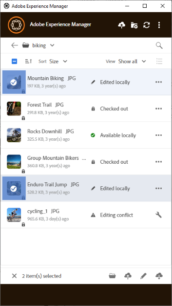
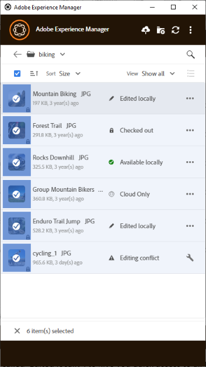

# 複数アセットの操作 {#work-with-multiple-assets}

ユーザーは、1 回の操作ですべての編集内容をアップロード、またはネストしたフォルダーを数回のクリックでアップロードするといったアクションを使用して、複数のアセットを容易に操作および管理することができます。

## 大きいフォルダーの参照 {#browse-large-folders}

多数のアセットを含んだフォルダーを操作する場合は、スクロールしてさらにアセットを表示します。 キーボードを使用してスクロールするには、Tab キーを数回押して、上部のアセットを選択します。 選択されたアセットが強調表示されます。 次に、下向き矢印キーを使用して、アセットのリスト内を移動します。

## 選択したアセットに対するクイックアクション {#quick-actions-for-selected-assets}

いくつかのアセットのサムネールをクリックすると、それらのアセットを選択できます。 すべてのアセットを選択するには、デスクトップアプリケーションの上部バーにあるチェックボックスをクリックします。 選択したすべてのアセットに対して一括で適用できる一連のアクションが、デスクトップアプリケーションの下部にあるツールバーに表示されます。

下部のツールバーで使用できるアクションは、選択したファイルのステータスによって異なります。 例えば、「**[!UICONTROL Edited Locally]**」ステータスのファイルだけを選択した場合は、「**[!UICONTROL Upload Changes]**」アイコンが表示されます。 「**[!UICONTROL Edited locally]**」ステータスと「**[!UICONTROL Cloud only]**」ステータスのファイルを同時に選択した場合、「**[!UICONTROL Upload Changes]**」アクションは使用できません。

## 次の手順 {#next-steps}

* [Adobe Experience Manager デスクトップアプリの使用を開始するビデオを見る](https://experienceleague.adobe.com/ja/docs/experience-manager-learn/assets/creative-workflows/aem-desktop-app)

* 右側のサイドバーにある「[!UICONTROL Edit this page]」または「[!UICONTROL Log an issue]」を使用してドキュメントに関するフィードバックを提供する

* [カスタマーケア](https://experienceleague.adobe.com/ja?support-solution=General#support)に問い合わせる

>[!MORELIKETHIS]
>
>* [アセットのアップロード](/help/using/upload-assets.md)
>* [アセットのダウンロード](/help/using/download-assets.md)
>* [検索](/help/using/search.md)
